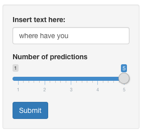
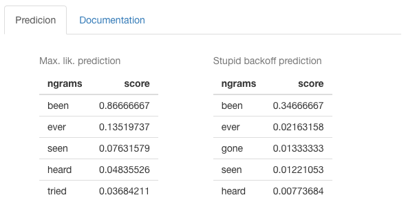

```{r setup, include=FALSE}
knitr::opts_chunk$set(echo = FALSE)
```

## The Application

<font size = "4"> Do you want to write faster messages, emails, tweets?

Then, take a look at our word predictor! </font>

<center> Our app predicts the next word that you will write while you are writing some text. </center>

<br>

<font size="4">

- it can be accessed at: https://m-couto.shinyapps.io/PredictNextWord/;

- and it predicts the word you will write with an accuracy of about 30%!

</font>


## The input

```{r}
setwd("~/Desktop/Data Science course/10. Data Science Capstone/PredictNextWord")
```

<font size="4">

- Just write some text in the empty box on the side panel; e.g. we wrote "where have you".

- You can also choose how many predictions you would like.

</font>

<br>

<center>  </center>


## The output

<font size="4">

Our app uses two statistical models to predict the most likely next word that you will write.

- more specifically, it uses the maximum likelihood model and the stupid backoff model.

We show below the predictions you get when you write "where have you".

Our app also shows the score of each prediction, ie. the probability of that word being the correct guess.

</font>

<center>  </center>


## Try it

Now go ahead and try it yourself. Enjoy!

https://m-couto.shinyapps.io/PredictNextWord/
